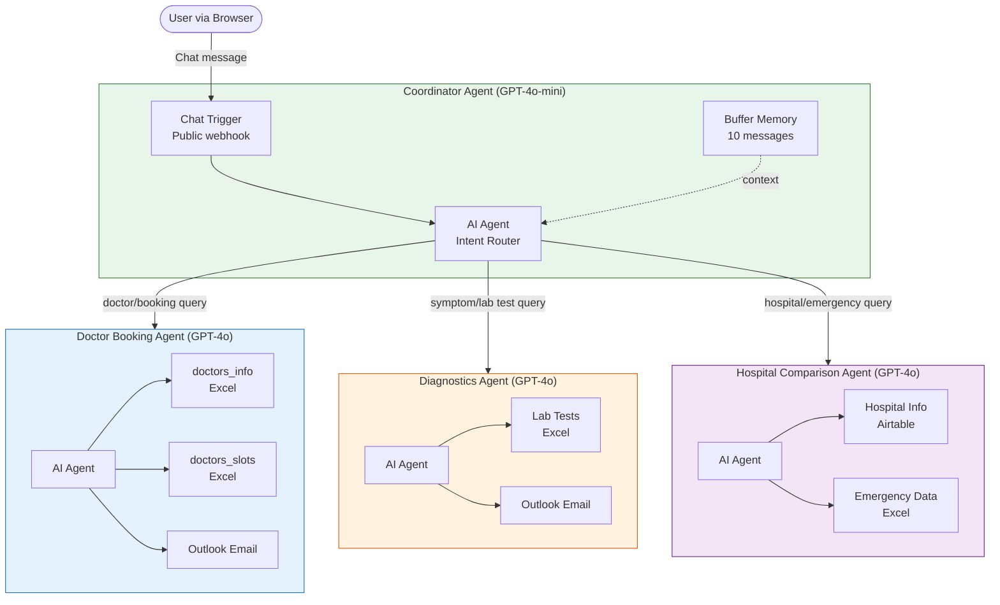

# HealthSense AI - Multi-Agent Healthcare System

**An intelligent, multi-agent healthcare assistant built on n8n that helps users book doctor appointments, get diagnostic lab test recommendations, and find hospital information through a single conversational interface.**

[](LICENSE)
[](https://n8n.io)
[](https://openai.com)

## Overview

HealthSense AI is a conversational healthcare assistant that combines multiple specialized AI agents into one seamless chat experience. Instead of navigating separate systems for booking appointments, understanding lab tests, or finding hospitals, users interact with a single chat widget that intelligently routes their requests to the right specialist agent behind the scenes.

The system is built entirely on n8n, an open-source workflow automation platform, making it easy to deploy, customize, and extend without writing traditional application code.

## Table of Contents

- [The Problem](#the-problem)
- [The Solution](#the-solution)
- [Who It Is For and Use Cases](#who-it-is-for-and-use-cases)
- [Key Features](#key-features)
- [Demo](#demo)
- [Architecture](#architecture)
- [Tech Stack](#tech-stack)
- [Prerequisites](#prerequisites)
- [Installation](#installation)
- [Configuration](#configuration)
- [Running the App](#running-the-app)
- [Using the App Step by Step](#using-the-app-step-by-step)
- [Workflow Walkthrough](#workflow-walkthrough)
- [Sample Data](#sample-data)
- [Customization](#customization)
- [Troubleshooting](#troubleshooting)
- [Project Structure](#project-structure)
- [Security Notes](#security-notes)
- [Contributing](#contributing)
- [License](#license)
- [Acknowledgments](#acknowledgments)

## The Problem

Navigating healthcare services is fragmented and time-consuming. A typical patient journey involves:

- **Finding a doctor**: Searching through directories, calling clinics, checking availability across multiple systems, and playing phone tag to find an open slot.
- **Understanding diagnostics**: Figuring out which lab tests are relevant for their symptoms, which hospitals offer them, and how to prepare, often requiring multiple web searches or calls.
- **Comparing hospitals**: Evaluating hospitals based on quality ratings, available services, emergency capabilities, and location, information scattered across different websites.

Each of these tasks requires a different tool or system, and none of them talk to each other. The user has to be the integration layer, copying information between systems and keeping track of context manually.

## The Solution

HealthSense AI unifies these three healthcare workflows into a single conversational interface:

| Pain Point | HealthSense AI Solution |
|---|---|
| Calling multiple clinics to find availability | Ask "I need a cardiologist" and get available slots instantly |
| Searching the web for lab test information | Describe your symptoms and get relevant tests with preparation instructions |
| Comparing hospitals across scattered websites | Ask "hospitals in Alabama with emergency services" and get structured results |
| Losing context between different systems | One continuous conversation with memory across all interactions |
| Forgetting appointment details | Automatic confirmation emails with all booking details |

The Coordinator Agent acts as a single point of contact, understanding the user's intent and routing to the appropriate specialist agent. Users never need to know which agent is handling their request.

## Who It Is For and Use Cases

### 1. Patients Looking for Quick Answers

**Persona**: A working professional with limited time to research healthcare options.
**Situation**: Experiencing persistent headaches and wants to know what tests to take and where.
**Outcome**: Types symptoms into the chat, receives a list of recommended lab tests with preparation instructions, and gets a preparation reminder emailed to them.

### 2. Healthcare Administrators Exploring AI Automation

**Persona**: A hospital IT manager evaluating AI-powered patient engagement tools.
**Situation**: Wants to prototype an intelligent front desk that handles common patient queries before they reach human staff.
**Outcome**: Imports the workflows into their n8n instance, connects to their own hospital database, and has a working prototype within hours.

### 3. n8n Developers Learning Multi-Agent Patterns

**Persona**: A workflow automation developer building complex AI systems.
**Situation**: Wants to learn how to orchestrate multiple AI agents using n8n's sub-workflow tool pattern.
**Outcome**: Studies the Coordinator-to-sub-agent architecture, the system prompt design, and the credential/data flow to apply the same pattern in other domains.

### 4. Students and Educators in Health Informatics

**Persona**: A university instructor teaching a course on health IT systems.
**Situation**: Needs a realistic, end-to-end example of an AI healthcare system for classroom demonstrations.
**Outcome**: Uses the bundled sample data and workflows to demonstrate agent orchestration, data integration, and conversational AI in a healthcare context.

## Key Features

### User-Facing Capabilities

- **Natural language doctor booking**: Find doctors by name or specialty, view available time slots, confirm appointments, and receive email confirmations.
- **Symptom-based diagnostics**: Describe symptoms in plain language and receive relevant lab test recommendations with hospital locations and preparation instructions.
- **Hospital search and comparison**: Search hospitals by location, compare quality ratings (overall, safety, mortality, readmission, patient experience), and check emergency services.
- **Email notifications**: Automatic confirmation emails for booked appointments and preparation reminders for recommended lab tests.
- **Conversation memory**: The Coordinator maintains a 10-message buffer so users can have multi-turn conversations without repeating context.

### Technical Features

- **Multi-agent orchestration**: A coordinator agent routes requests to specialized sub-agents using n8n's sub-workflow tool pattern.
- **Custom chat UI**: A polished, branded chat widget with custom CSS theming (green color scheme, smooth animations, responsive design).
- **Multiple data backends**: Integrates with Microsoft SharePoint (Excel), Airtable, and Microsoft Outlook in a single system.
- **Stateless sub-agents**: Sub-agents receive full context from the Coordinator on each call, making them independently testable and replaceable.

### Intentionally Not Included

- **Real appointment persistence**: Bookings are confirmed via email but not written to a database. This is a demonstration system.
- **Patient authentication**: The chat widget is public. A production system would require login.
- **HIPAA compliance**: This system uses sample data and is not designed for real patient information.

## Demo

### Chat Widget

```
+------------------------------------------+
|  Welcome to HealthSense AI               |
|  Start a chat. We're here to help 24/7.  |
+------------------------------------------+
|                                           |
|  Bot: Hi there! I am HealthSense AI.      |
|       How can I assist you today?         |
|                                           |
|                     User: I need to see   |
|                     a cardiologist        |
|                                           |
|  Bot: I found the following              |
|  cardiologists with available slots:      |
|                                           |
|  > Doctor: Dr. Nancy Martinez             |
|  > Specialization: Cardiology             |
|  > Next Available: Mar 5 at 9:00 AM       |
|  > Contact: (645) 088-6039               |
|                                           |
|  Would you like to confirm this           |
|  appointment?                             |
|                                           |
+------------------------------------------+
| Type a message...                 [Send]  |
+------------------------------------------+
```

### Example Conversations

**Doctor Booking**:
```
User: I need to see a cardiologist
Bot:  [Finds doctors, shows available slots]
User: Yes, confirm the appointment
Bot:  Please provide your email address
User: john@example.com
Bot:  Appointment confirmed! Confirmation email sent.
```

**Diagnostics**:
```
User: What tests should I take for persistent headaches?
Bot:  Based on your symptoms, I recommend:
      - MRI Scan at Marshall Medical Center (Boaz, AL)
        Preparation: Wear loose and comfortable clothing.
      - ECG at Crestwood Medical Center (Huntsville, AL)
        Preparation: Avoid caffeine for 24 hours.
      Would you like a preparation reminder via email?
```

**Hospital Search**:
```
User: List hospitals in Alabama
Bot:  Marshall Medical Center South - Boaz, AL
      Rating: 3/5, Emergency: Yes
      Wedowee Hospital - Wedowee, AL
      Rating: 4/5, Emergency: Yes
      ...
```

## Architecture

The system follows a coordinator pattern where a single user-facing agent orchestrates multiple specialist agents:



For detailed architecture documentation including sequence diagrams, data flow,
trust boundaries, and design invariants, see [docs/architecture.md](docs/architecture.md).

## Tech Stack

| Layer | Technology | Purpose |
|---|---|---|
| Orchestration | [n8n](https://n8n.io) (v1.70+) | Workflow automation platform hosting all agents |
| LLM (Coordinator) | OpenAI GPT-4o-mini | Fast, cost-effective intent routing |
| LLM (Sub-agents) | OpenAI GPT-4o | High-accuracy domain-specific reasoning |
| Doctor/Slot Data | Microsoft SharePoint (Excel Online) | Stores doctor profiles and appointment slots |
| Lab Test Data | Microsoft SharePoint (Excel Online) | Stores lab tests, hospitals, and preparation info |
| Hospital Data | Airtable | Stores ~2,988 US hospital records with quality ratings |
| Emergency Data | Microsoft SharePoint (Excel Online) | Stores ambulance availability by zip code |
| Email Delivery | Microsoft Outlook (Graph API) | Sends confirmation and reminder emails |
| Chat UI | n8n Chat Trigger widget | Embedded browser chat with custom CSS theming |
| Memory | n8n Buffer Window Memory | Maintains 10-message conversation context |

## Prerequisites

| Requirement | Version / Details |
|---|---|
| n8n | 1.70 or later (Cloud account or self-hosted via Docker) |
| OpenAI API key | With access to `gpt-4o` and `gpt-4o-mini` models |
| Microsoft 365 account | Business or Enterprise with SharePoint and Outlook |
| Azure AD app registration | With `Files.Read`, `Files.ReadWrite`, and `Mail.Send` permissions |
| Airtable account | Free tier is sufficient; need a personal access token |
| Docker (self-hosted only) | 20.10 or later |
| Browser | Chrome, Firefox, Safari, or Edge (latest) |

Estimated cost per 1,000 conversations (assuming ~5 messages each):

| Service | Approximate Cost |
|---|---|
| OpenAI API (GPT-4o + GPT-4o-mini) | ~$2-5 |
| n8n Cloud (Starter plan) | Included in plan |
| Microsoft 365 | Included in subscription |
| Airtable | Free tier covers it |

## Installation

### Option A: n8n Cloud (Recommended)

1. Sign up at [app.n8n.cloud](https://app.n8n.cloud) if you do not have an
   account.

2. Clone this repository:
   ```bash
   git clone https://github.com/ANI-IN/AI-Driven-Multi-Agent-Healthcare-System-with-n8n.git
   cd AI-Driven-Multi-Agent-Healthcare-System-with-n8n
   ```

3. Import the workflows in order (sub-agents first):
   - In the n8n UI, click the three-dot menu and select "Import from File"
   - Import `workflows/Hospital Comparison Agent.json`
   - Import `workflows/Doctor Booking Agent.json`
   - Import `workflows/Diagnostics Agent.json`
   - Import `workflows/Coordinator Agent.json`

4. Continue to [Configuration](#configuration).

### Option B: Self-Hosted with Docker

1. Clone the repository:
   ```bash
   git clone https://github.com/ANI-IN/AI-Driven-Multi-Agent-Healthcare-System-with-n8n.git
   cd AI-Driven-Multi-Agent-Healthcare-System-with-n8n
   ```

2. Set up your environment:
   ```bash
   cp .env.example .env
   # Edit .env and fill in your API keys and credentials
   ```

3. Start n8n with Docker:
   ```bash
   docker run -it --rm \
     --name n8n \
     -p 5678:5678 \
     --env-file .env \
     -v n8n_data:/home/node/.n8n \
     docker.n8n.io/n8nio/n8n
   ```

4. Open `http://localhost:5678` in your browser and create an owner account.

5. Import the workflow JSON files from the `workflows/` folder as described
   in Option A, step 3.

6. Continue to [Configuration](#configuration).

## Configuration

### Credentials Setup

After importing the workflows, configure these credentials in n8n
(Settings > Credentials > Add Credential):

| Credential | Type | Required Permissions | Used By |
|---|---|---|---|
| OpenAI | OpenAI API | API key access | All workflows |
| Microsoft Excel | Microsoft Excel OAuth2 | `Files.Read`, `Files.ReadWrite` | Booking, Diagnostics, Hospital |
| Microsoft Outlook | Microsoft Outlook OAuth2 | `Mail.Send` | Booking, Diagnostics |
| Airtable | Airtable Personal Access Token | `data.records:read` | Hospital Comparison |

### Sub-Workflow References

After importing, open the **Coordinator Agent** workflow and update each
sub-workflow tool node to reference the correct workflow:

1. Click the "Doctor Booking Agent" node, select the imported Doctor Booking
   workflow.
2. Click the "Diagnostics Agent" node, select the imported Diagnostics
   workflow.
3. Click the "Hospital Comparison Agent" node, select the imported Hospital
   Comparison workflow.

### Environment Variables

| Variable | Required | Default | Description |
|---|---|---|---|
| `OPENAI_API_KEY` | Yes | - | OpenAI API key for GPT-4o and GPT-4o-mini |
| `MICROSOFT_CLIENT_ID` | Yes | - | Azure AD app client ID for SharePoint and Outlook |
| `MICROSOFT_CLIENT_SECRET` | Yes | - | Azure AD app client secret |
| `MICROSOFT_TENANT_ID` | Yes | - | Azure AD tenant ID |
| `AIRTABLE_API_TOKEN` | Yes | - | Airtable personal access token |
| `N8N_PORT` | No | `5678` | Port for the n8n web UI (self-hosted only) |
| `N8N_ENCRYPTION_KEY` | Yes (self-hosted) | - | Encryption key for stored credentials |
| `WEBHOOK_URL` | No | auto-detected | Base URL for webhook endpoints |

### Tunable Parameters

| Parameter | Location | Default | What It Controls |
|---|---|---|---|
| Chat greeting message | Coordinator Agent > Chat Trigger > Initial Messages | "Hi there! I am HealthSense AI..." | The welcome message users see |
| Chat window title | Coordinator Agent > Chat Trigger > Options > Title | "Welcome to HealthSense AI" | Title bar of the chat widget |
| Conversation memory length | Coordinator Agent > Agent Simple Memory > Context Window Length | 10 | Number of prior messages retained |
| Coordinator LLM model | Coordinator Agent > OpenAI Chat Model2 > Model | gpt-4o-mini | Model used for intent routing |
| Sub-agent LLM model | Each sub-agent > OpenAI Chat Model > Model | gpt-4o | Model used for domain reasoning |
| Diagnostics session key | Diagnostics Agent > Simple Memory > Session Key | "latest" | Memory session identifier |

## Running the App

1. Make sure all credentials are configured and the data sources are
   populated (see [Configuration](#configuration)).

2. Open the **Coordinator Agent** workflow in the n8n editor.

3. Toggle the workflow to **Active** (top-right corner).

4. Find the chat URL:
   - Click the "When chat message received" node.
   - Copy the **Production** webhook URL.
   - Open it in your browser.

5. The HealthSense AI chat widget should appear with the welcome message.

To test without activating:
- Open the Coordinator Agent workflow in the n8n editor.
- Click "Chat" in the bottom panel to use the built-in test chat.

## Using the App Step by Step

### Booking a Doctor Appointment

1. Open the chat widget.
2. Type: "I need to see a cardiologist" (or any specialty).
3. The system looks up matching doctors and shows available slots.
4. Type: "Yes, confirm the appointment" to proceed.
5. When asked, provide your email address.
6. The system sends a confirmation email and confirms in the chat.

### Getting Diagnostic Recommendations

1. Open the chat widget.
2. Type: "What tests should I take for persistent headaches?"
3. The system searches the lab test database and returns matching tests with:
   - Test name and description
   - Hospital name and city
   - Preparation instructions
4. If you want a reminder, say "Yes" when asked.
5. Provide your email to receive preparation instructions.

### Searching for Hospitals

1. Open the chat widget.
2. Type: "List hospitals in Alabama" (or any state/city/zip code).
3. The system queries the hospital database and returns results with:
   - Hospital name, address, phone number
   - Hospital type and ownership
   - Overall rating and quality comparisons
   - Emergency services availability

### Checking Emergency Services

1. Open the chat widget.
2. Type: "Is there an ambulance available in zip code 10001?"
3. The system checks the emergency data and reports ambulance availability
   for hospitals in that area.

## Workflow Walkthrough

### 1. Coordinator Agent (`workflows/Coordinator Agent.json`)

The entry point for all user interactions. Contains 6 nodes:

| Node | Type | Purpose |
|---|---|---|
| When chat message received | Chat Trigger | Public webhook that renders the chat widget in the browser. Includes extensive custom CSS for a branded green theme. |
| OpenAI Chat Model2 | OpenAI Chat Model | GPT-4o-mini instance for cost-effective intent routing. |
| Coordinator | AI Agent | The orchestrator. Its system prompt defines it as "Hero," an agent that never answers directly but calls the correct tool and relays its response. |
| Agent Simple Memory | Buffer Window Memory | Retains the last 10 messages for multi-turn conversations. |
| Doctor Booking Agent | Tool Workflow | Routes booking queries to the Doctor Booking sub-workflow. |
| Diagnostics Agent | Tool Workflow | Routes symptom/lab test queries to the Diagnostics sub-workflow. |
| Hospital Comparison Agent | Tool Workflow | Routes hospital/emergency queries to the Hospital Comparison sub-workflow. |

**Execution flow**: Chat Trigger receives user message, passes it to the
Coordinator AI Agent (with memory and LLM attached), which decides which tool
to call based on the system prompt's routing logic.

### 2. Doctor Booking Agent (`workflows/Doctor Booking Agent.json`)

Handles appointment discovery and booking. Contains 7 nodes:

| Node | Type | Purpose |
|---|---|---|
| start_wf | Execute Workflow Trigger | Entry point when called by the Coordinator. |
| AI Agent | AI Agent | GPT-4o-powered agent with a detailed booking workflow in its system prompt. |
| OpenAI Chat Model | OpenAI Chat Model | GPT-4o instance for accurate medical context handling. |
| doctors_info | Microsoft Excel Tool | Reads doctor profiles (name, specialization, contact) from SharePoint. |
| doctors_slots | Microsoft Excel Tool | Reads appointment slots (datetime, availability) from SharePoint. |
| email_user | Microsoft Outlook Tool | Sends appointment confirmation emails. |
| Sticky Note | Sticky Note | Visual label "Booking Agent" in the n8n editor. |

**Execution flow**: Receives query from Coordinator, extracts doctor/specialty,
queries `doctors_info` for matching doctors, queries `doctors_slots` for
available times, presents the first available slot, asks for confirmation and
email, then sends a confirmation email via Outlook.

### 3. Diagnostics Agent (`workflows/Diagnostics Agent.json`)

Handles lab test recommendations and preparation reminders. Contains 6 nodes:

| Node | Type | Purpose |
|---|---|---|
| start_wf | Execute Workflow Trigger | Entry point when called by the Coordinator. |
| AI Agent | AI Agent | GPT-4o-powered agent with a diagnostic workflow in its system prompt. |
| OpenAI Chat Model | OpenAI Chat Model | GPT-4o instance. |
| Simple Memory | Buffer Window Memory | Session memory keyed to "latest" for multi-turn diagnostic conversations. |
| Hospital Info with Lab Tests | Microsoft Excel Tool | Reads lab tests with hospital information and preparation instructions from SharePoint. |
| send_email | Microsoft Outlook Tool | Sends preparation reminder emails. |

**Execution flow**: Receives symptom description, searches the lab test
database for matching tests (by associated symptoms), formats results with
test name, description, hospital, and preparation instructions, then
optionally sends a preparation reminder via email.

### 4. Hospital Comparison Agent (`workflows/Hospital Comparison Agent.json`)

Handles hospital lookups and emergency service queries. Contains 7 nodes:

| Node | Type | Purpose |
|---|---|---|
| When Executed by Another Workflow | Execute Workflow Trigger | Entry point when called by the Coordinator. |
| AI Agent | AI Agent | GPT-4o-powered agent with hospital search logic in its system prompt. |
| OpenAI Chat Model | OpenAI Chat Model | GPT-4o instance. |
| Hospital General Info | Airtable Tool | Searches ~2,988 US hospital records using Airtable formulas. |
| Hospital Emergency Data | Microsoft Excel Tool | Reads ambulance availability by zip code from SharePoint. |
| Sticky Note | Sticky Note | Visual label "Search in Hospitals" in the n8n editor. |

**Execution flow**: Receives location/criteria query, constructs an Airtable
filter formula (using LOWER() for case-insensitive search), queries the
Hospital_General_Information table, and formats results with hospital details,
quality ratings, and emergency service information.

## Sample Data

The `datasets/` folder contains five Excel datasets:

| Dataset | Rows | Columns | Description |
|---|---|---|---|
| `doctors_info_data.xlsx` | 28 | 4 | Doctor profiles: id, name, specialization, contact number |
| `doctors_slots_data.xlsx` | 3,024 | 4 | Appointment slots: id, doctor_id, datetime, is_available |
| `Hospital_General_Info_Trim.xlsx` | 2,987 | 30 | US hospital records with quality ratings, addresses, and contact information |
| `Lab_Tests_Trimmed.xlsx` | 3,402 | 16 | Lab tests mapped to hospitals with diagnostic test names, health packages, and preparation instructions |
| `hospitals_emergency_data.xlsx` | 31 | 3 | Ambulance availability by zip code and hospital name |

### Try Asking

| Query | Expected Data Source | What You Should See |
|---|---|---|
| "I need to see a cardiologist" | doctors_info + doctors_slots | Cardiologists with available appointment times |
| "Book an appointment with Dr. Linda Lee" | doctors_info + doctors_slots | Dr. Lee's next available slot |
| "What tests for persistent headaches?" | Lab_Tests_Trimmed | MRI, ECG, and similar tests with preparation instructions |
| "Hospitals in Alabama" | Hospital_General_Info_Trim | Hospitals in AL with ratings and contact info |
| "Is there an ambulance in zip 10001?" | hospitals_emergency_data | Ambulance availability for hospitals in zip 10001 |
| "Compare hospital ratings in Huntsville" | Hospital_General_Info_Trim | Hospital quality metrics for Huntsville, AL |

## Customization

### Changing the Chat Theme

The chat widget's appearance is controlled by custom CSS in the Coordinator
Agent's Chat Trigger node (`workflows/Coordinator Agent.json`, "When chat message
received" node, `options.customCss` field). Key CSS variables to modify:

| Variable | Current Value | What It Controls |
|---|---|---|
| `--chat--color-primary` | `#3DAA6E` | Brand color (green) |
| `--chat--window--width` | `420px` | Chat window width |
| `--chat--window--height` | `640px` | Chat window height |
| `--chat--header--background` | `#3DB870` | Header background color |
| `--chat--message--bot--background` | `#FFFFFF` | Bot message bubble color |
| `--chat--message--user--background` | `linear-gradient(135deg, #3DAA6E, #62C98A)` | User message bubble gradient |
| `--chat--toggle--size` | `60px` | Chat toggle button size |

### Adding a New Specialist Agent

1. Create a new n8n workflow with an Execute Workflow Trigger node.
2. Add an AI Agent node with a GPT-4o model and a system prompt describing
   the agent's domain.
3. Connect the data sources (Excel, Airtable, API, etc.) as tool nodes.
4. In the Coordinator Agent workflow, add a new Tool Workflow node pointing
   to your new workflow.
5. Update the Coordinator's system prompt to describe when to call the
   new tool.

### Switching LLM Providers

Each workflow's OpenAI Chat Model node can be replaced with any LangChain-
compatible LLM node in n8n (Anthropic, Google Gemini, Ollama, Azure OpenAI,
etc.). After replacing:

1. Update the model node's credentials.
2. Test the agent's responses, since system prompt effectiveness varies
   across models.
3. Adjust the system prompt if needed for the new model's behavior.

### Using Different Data Sources

The Microsoft Excel Tool nodes can be replaced with:

- **Google Sheets Tool**: For Google Workspace environments.
- **Postgres/MySQL Tool**: For database-backed data.
- **HTTP Request Tool**: For REST API data sources.
- **Airtable Tool**: To consolidate all data in Airtable.

Update the agent's system prompt to reflect the new data schema if column
names change.

## Troubleshooting

| Problem | Cause | Fix |
|---|---|---|
| Chat widget shows "Workflow could not be started" | Coordinator workflow is not active | Open the Coordinator Agent workflow and toggle it to Active |
| "Error in expression" in a node | An n8n expression like `{{ $json.query }}` cannot resolve | Check that the upstream node is sending data in the expected format. Verify the connection between nodes. |
| Sub-agent returns empty or wrong results | The sub-workflow tool node points to the wrong workflow ID | Open the Coordinator workflow, click each tool node, and re-select the correct sub-workflow |
| "Credentials not found" error | The credential referenced in the JSON does not exist in your n8n instance | Create the credential in Settings > Credentials and re-select it in the affected node |
| Microsoft Excel node returns no data | The SharePoint file URL or workbook ID does not match your environment | Upload the dataset files to your own SharePoint and update the node's workbook/worksheet references |
| Airtable node returns "INVALID_FILTER_BY_FORMULA" | The AI-generated Airtable formula has syntax errors | This is intermittent. Retry the query. If persistent, check that the table column names match the system prompt |
| Email is not delivered | Outlook OAuth2 token expired or Mail.Send permission is missing | Re-authenticate the Outlook credential in n8n. Verify the Azure AD app has Mail.Send permission. |
| 429 "Rate limit exceeded" from OpenAI | Too many concurrent requests to the OpenAI API | Wait 60 seconds and retry. Consider upgrading your OpenAI plan or switching the Coordinator to a cheaper model. |
| Diagnostics Agent shares memory between users | The session key is hardcoded to "latest" | Change the Simple Memory node's session key to use a dynamic value like the user's session ID |
| Chat widget does not load custom styling | Browser cache is serving an old version | Hard-refresh the page (Ctrl+Shift+R / Cmd+Shift+R) or open in an incognito window |

## Project Structure

```
AI-Driven-Multi-Agent-Healthcare-System-with-n8n/
|
|-- workflows/                      # n8n workflow definitions
|   |-- Coordinator Agent.json      # Main orchestrator (chat-facing)
|   |-- Doctor Booking Agent.json   # Sub-workflow for doctor search and booking
|   |-- Diagnostics Agent.json      # Sub-workflow for lab test recommendations
|   |-- Hospital Comparison Agent.json  # Sub-workflow for hospital lookup
|
|-- datasets/                       # Sample data files
|   |-- doctors_info_data.xlsx      # 28 doctor profiles
|   |-- doctors_slots_data.xlsx     # 3,024 appointment slots
|   |-- Hospital_General_Info_Trim.xlsx  # 2,987 US hospital records
|   |-- Lab_Tests_Trimmed.xlsx      # 3,402 lab test records
|   |-- hospitals_emergency_data.xlsx   # 31 emergency service records
|
|-- docs/                           # Documentation
|   |-- architecture.md             # Architecture with mermaid diagrams
|   |-- getting-started.md          # Setup and first-run guide
|   |-- AI-Driven Multi-Agent Healthcare System.docx  # Original design document
|
|-- .github/                        # GitHub templates
|   |-- ISSUE_TEMPLATE/
|   |   |-- bug_report.md
|   |   |-- feature_request.md
|   |-- PULL_REQUEST_TEMPLATE.md
|
|-- .gitignore                      # Git ignore rules
|-- .editorconfig                   # Editor configuration
|-- .env.example                    # Environment variable template
|-- LICENSE                         # MIT License
|-- README.md                       # This file
|-- CONTRIBUTING.md                 # Contribution guidelines
|-- CODE_OF_CONDUCT.md             # Community code of conduct
|-- SECURITY.md                     # Security policy
|-- CHANGELOG.md                    # Change log
```

## Security Notes

This project handles healthcare-related data and integrates with external
services. Key security considerations:

- **No real patient data**: The bundled datasets contain synthetic sample data
  only. Do not use this system with real patient information without proper
  compliance review.
- **Public chat endpoint**: The Chat Trigger is configured without
  authentication. For production use, enable Header Auth or Basic Auth.
- **Credential management**: Never commit real API keys or OAuth tokens.
  Use n8n's built-in credential store and environment variables.
- **Email validation**: User-provided email addresses are passed to Outlook
  without server-side validation. Add input validation for production use.

For the full security policy, supported versions, and how to report
vulnerabilities, see [SECURITY.md](SECURITY.md).

## Contributing

Contributions are welcome. Before you start:

1. Read the [Contributing Guidelines](CONTRIBUTING.md).
2. Review the [Code of Conduct](CODE_OF_CONDUCT.md).
3. Check existing [issues](https://github.com/ANI-IN/AI-Driven-Multi-Agent-Healthcare-System-with-n8n/issues)
   to avoid duplicating work.

## License

This project is licensed under the MIT License. See [LICENSE](LICENSE) for
the full text.

## Acknowledgments

- [n8n](https://n8n.io/) for the workflow automation platform.
- [OpenAI](https://openai.com/) for the GPT-4o and GPT-4o-mini language
  models.
- [Microsoft Graph API](https://learn.microsoft.com/en-us/graph/) for
  SharePoint Excel and Outlook integration.
- [Airtable](https://airtable.com/) for the hospital information database.
- The US Centers for Medicare and Medicaid Services (CMS) for the hospital
  quality comparison data that inspired the sample dataset structure.
