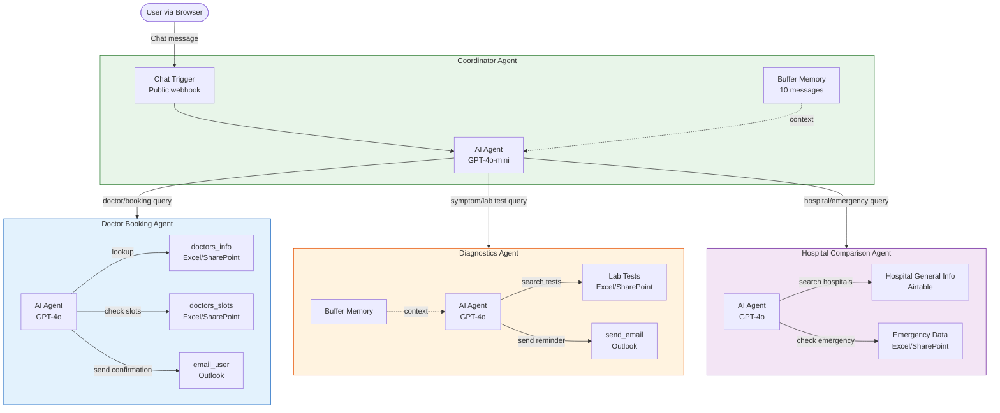
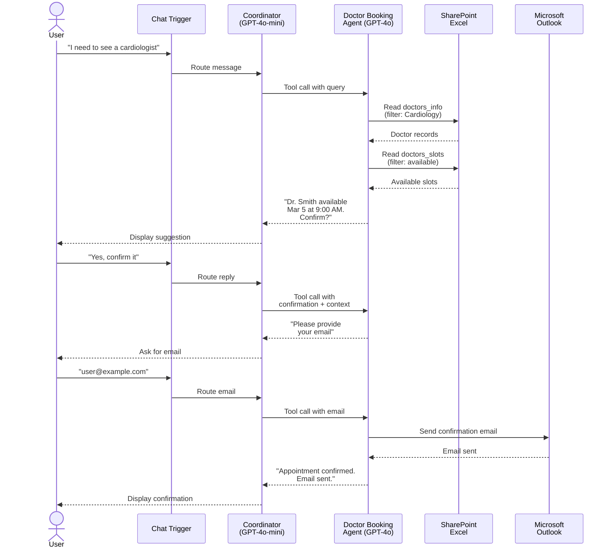
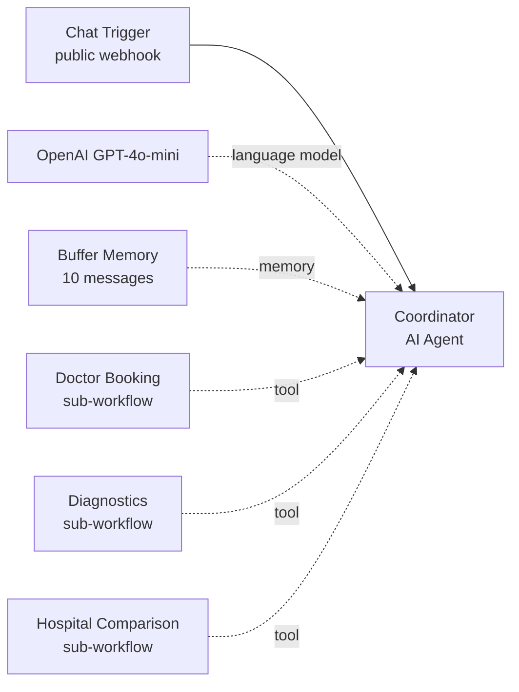
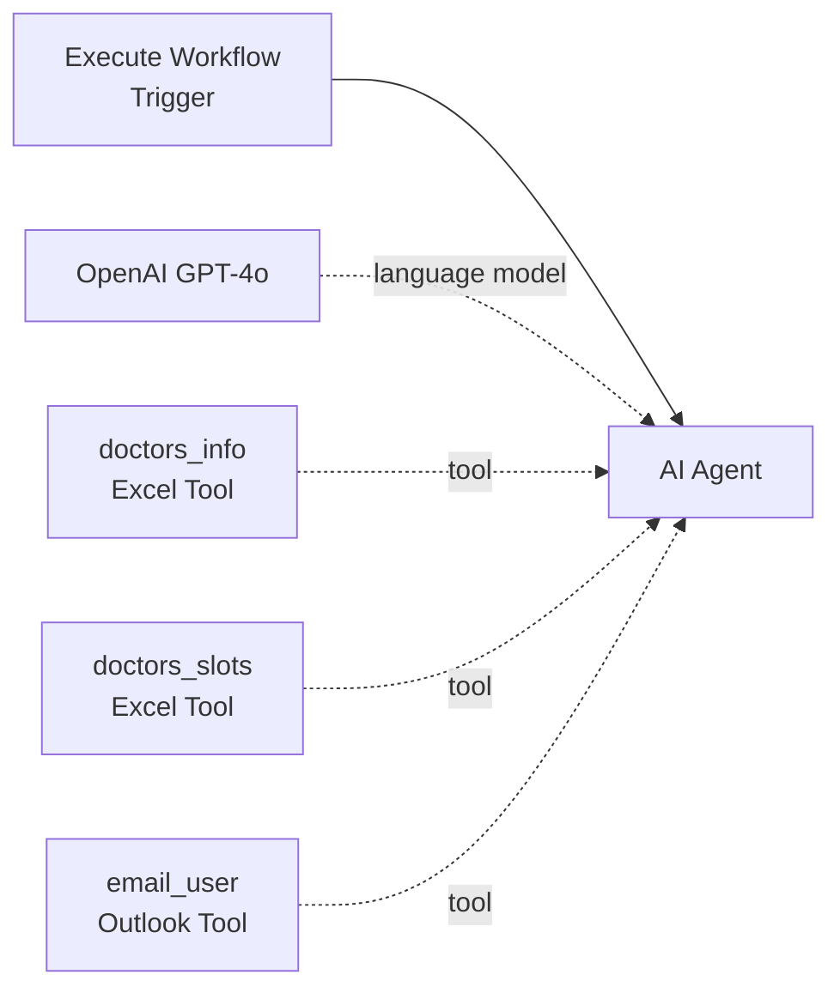
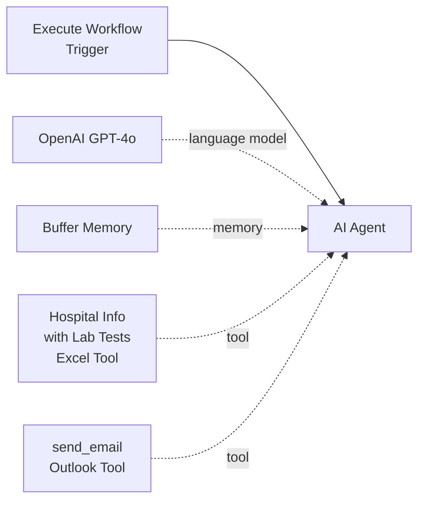
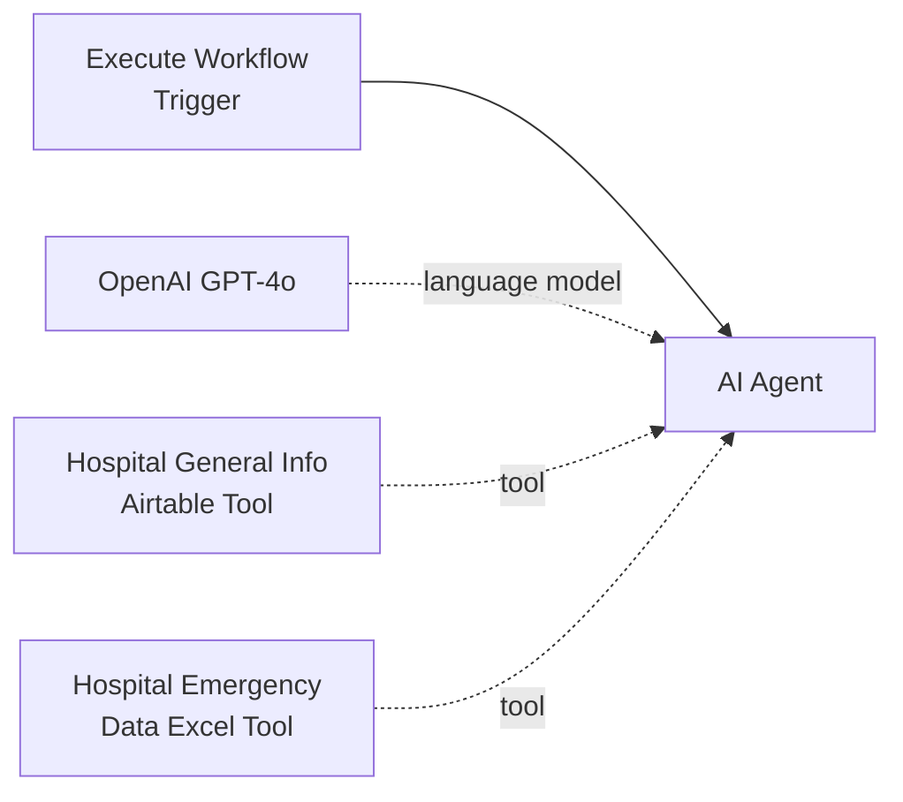
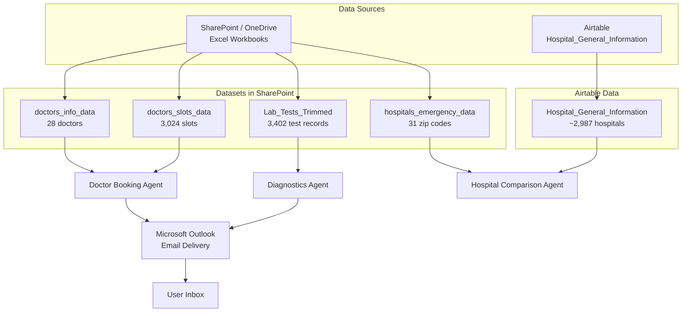
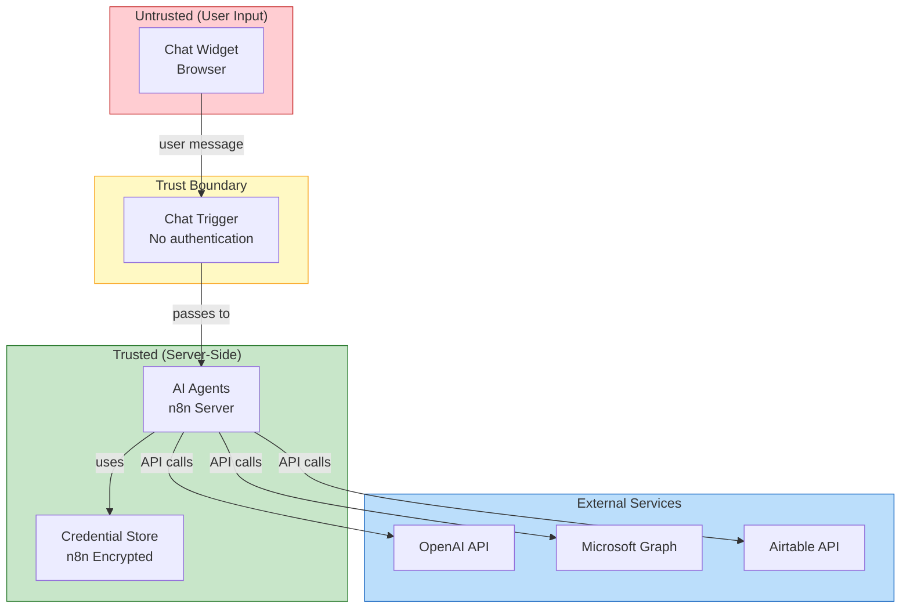

# Architecture Overview

This document describes the system architecture of HealthSense AI, a
multi-agent healthcare assistant built on n8n.

## Table of Contents

- [System Overview](#system-overview)
- [High-Level Architecture](#high-level-architecture)
- [Agent Interaction Flow](#agent-interaction-flow)
- [Workflow Diagrams](#workflow-diagrams)
- [What Lives Where](#what-lives-where)
- [External Services](#external-services)
- [Data Flow](#data-flow)
- [Trust Boundaries](#trust-boundaries)
- [Design Invariants](#design-invariants)

## System Overview

HealthSense AI is a conversational healthcare assistant that helps users with
three primary tasks:

1. **Doctor Booking**: Find doctors by name or specialty, check availability,
   book appointments, and send confirmation emails.
2. **Diagnostics**: Recommend lab tests based on symptoms and send preparation
   reminders via email.
3. **Hospital Information**: Look up hospitals by location, compare quality
   ratings, and check emergency services and ambulance availability.

The system uses a coordinator pattern: a single user-facing agent (the
Coordinator) receives all chat messages and routes them to specialized
sub-agents based on the user's intent.

## High-Level Architecture

## Agent Interaction Flow

This sequence diagram shows a typical doctor booking conversation from start
to finish:

## Workflow Diagrams

### Coordinator Agent (Coordinator Agent.json)

### Doctor Booking Agent (Doctor Booking Agent.json)

### Diagnostics Agent (Diagnostics Agent.json)

### Hospital Comparison Agent (Hospital Comparison Agent.json)

## What Lives Where

| Responsibility | File | Key Nodes |
|---|---|---|
| User-facing chat interface | `workflows/Coordinator Agent.json` | "When chat message received" (Chat Trigger) |
| Intent routing and orchestration | `workflows/Coordinator Agent.json` | "Coordinator" (AI Agent with system prompt) |
| Conversation memory | `workflows/Coordinator Agent.json` | "Agent Simple Memory" (Buffer Window, 10 messages) |
| Doctor lookup | `workflows/Doctor Booking Agent.json` | "doctors_info" (Microsoft Excel Tool) |
| Slot availability check | `workflows/Doctor Booking Agent.json` | "doctors_slots" (Microsoft Excel Tool) |
| Appointment confirmation email | `workflows/Doctor Booking Agent.json` | "email_user" (Microsoft Outlook Tool) |
| Lab test recommendations | `workflows/Diagnostics Agent.json` | "Hospital Info with Lab Tests" (Microsoft Excel Tool) |
| Test preparation email reminders | `workflows/Diagnostics Agent.json` | "send_email" (Microsoft Outlook Tool) |
| Hospital search and comparison | `workflows/Hospital Comparison Agent.json` | "Hospital General Info" (Airtable Tool) |
| Emergency and ambulance lookup | `workflows/Hospital Comparison Agent.json` | "Hospital Emergency Data" (Microsoft Excel Tool) |

## External Services

| Service | Purpose | Auth Method | Used By |
|---|---|---|---|
| OpenAI API | LLM inference (GPT-4o, GPT-4o-mini) | API Key | All workflows |
| Microsoft SharePoint / OneDrive | Excel data storage for doctors, slots, lab tests, emergency data | OAuth2 | Booking, Diagnostics, Hospital |
| Microsoft Outlook | Sending confirmation and reminder emails | OAuth2 | Booking, Diagnostics |
| Airtable | Hospital general information database (~2,988 records) | Personal Access Token | Hospital Comparison |

## Data Flow

## Trust Boundaries

Key trust boundary observations:

1. **No webhook authentication**: The Chat Trigger node is set to
   `public: true`. Any user who knows the webhook URL can send messages.
   This is the primary entry point for untrusted input.
2. **User input flows to LLM prompts**: The user's chat message is passed
   directly into the AI Agent's prompt. The system prompts constrain behavior
   but do not sanitize input.
3. **User input reaches email fields**: The user provides the recipient email
   address for confirmation emails. This value is passed to the Outlook tool
   without server-side validation.
4. **Credential isolation**: n8n stores credentials encrypted and separate
   from workflow definitions. The JSON files only contain credential IDs,
   not values.

## Design Invariants

1. **Coordinator never answers directly**: The Coordinator Agent's system
   prompt enforces that it only relays responses from sub-agent tools. It
   never generates healthcare information on its own.
2. **Sub-agents are stateless**: The Doctor Booking and Hospital Comparison
   agents have no memory nodes. The Coordinator must inject prior context
   into each tool call. The Diagnostics Agent has a buffer memory keyed to
   a static session ("latest"), which means concurrent users would share
   context (a known limitation).
3. **Data is read-only**: All workflows read from external data sources but
   never write back. Appointments are "booked" by sending a confirmation
   email, not by updating a database record.
4. **Single LLM provider**: All agents use OpenAI models. The Coordinator
   uses GPT-4o-mini for cost efficiency; sub-agents use GPT-4o for accuracy.
5. **Execution order v1**: All workflows use n8n's v1 execution order, which
   processes nodes breadth-first.
